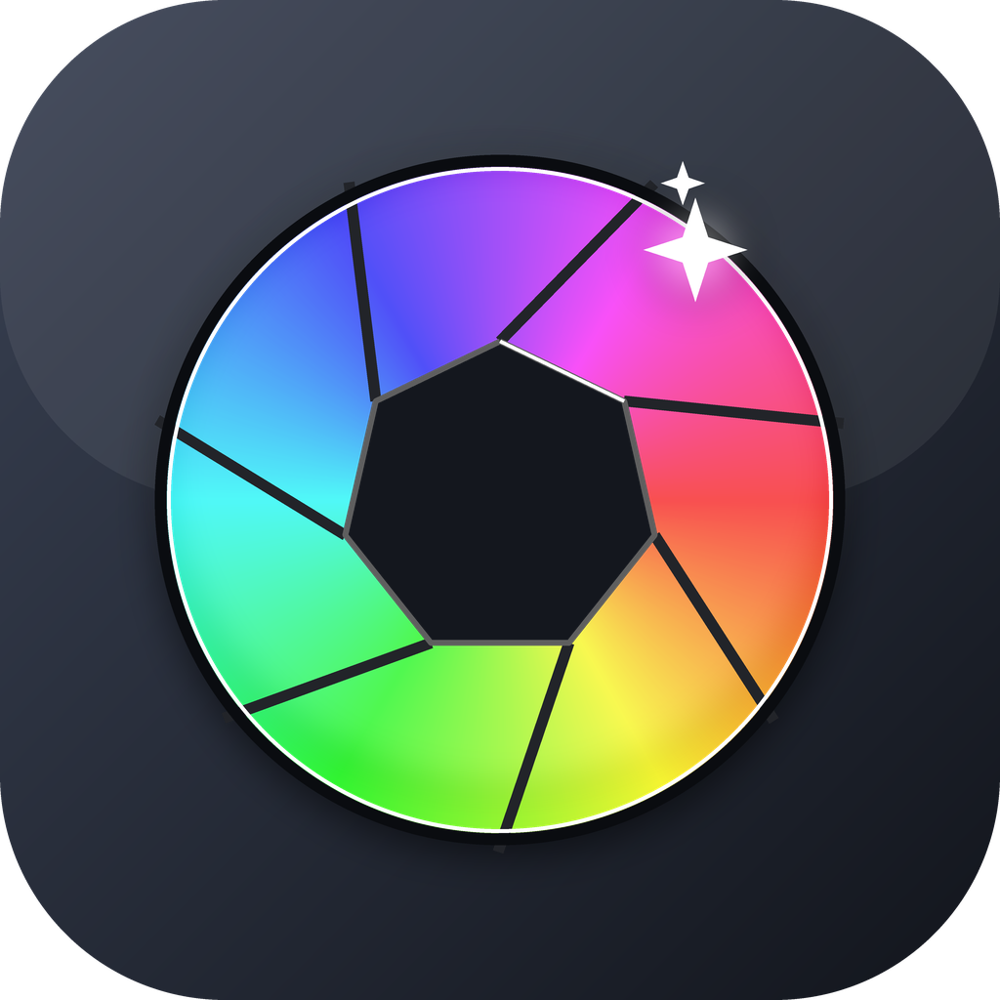
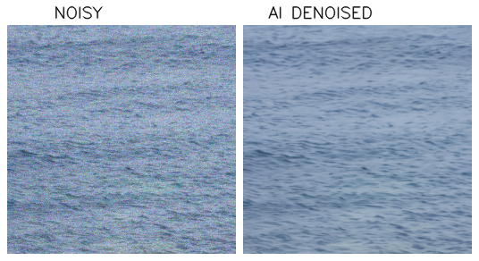

<div align="center">


# Autoshop

**AI-assisted automatic development of RAW photographs.**

Point it at a RAW (or an exported PNG/TIFF); an AI advisor decides the develop
adjustments and a deterministic Rust engine applies them — or writes an XMP
sidecar so the edit opens as adjustable sliders in Lightroom.
</div>

---

## The idea

The judgement-heavy part of developing a photo is *deciding what to change*
(this sky is blown, those shadows are crushed, the white balance is too cool).
The mechanical part is *applying* it. Autoshop splits exactly there:

```
 RAW ─► decode + features ─► [GPT vision advisor] ─► EditRecipe ─► [Claude verify] ─► Rust render engine
  .ARW    preview+EXIF+hist        looks at photo        JSON          QA / accept           │
                                                                                             ▼
                                                                    XMP sidecar  +  16-bit master
```

**The AI never touches a pixel** in the main path. The vision model only emits an
[`EditRecipe`](src/recipe.rs) — a small, bounded, Lightroom/ACR-style JSON of
slider values — and a deterministic engine renders from the original RAW. That
keeps results reproducible, non-destructive, auditable, and free of hallucinated
detail. (Two *opt-in*, clearly-labelled exceptions touch pixels: AI **denoise**
and **generative** retouch — see below.)

## Features

- **One-shot develop** — `auto` decodes a RAW, asks GPT for an `EditRecipe`, has
  Claude acceptance-verify it, then renders a **16-bit TIFF** master.
- **XMP sidecar** — the same recipe serialises to an ACR/Lightroom `.xmp`
  (global sliders + local linear/radial masks), so the AI's edit opens as
  fully-adjustable sliders in your catalog.
- **AI Denoise (SCUNet, GPU)** — ACR/LR-style denoise for high-ISO / astro
  frames. Off by default, triggered by a flag, a CLI command, or a UI button.
- **PNG/TIFF source mode** — feed an already-processed image (e.g. denoised in
  Lightroom/Photoshop) and Autoshop grades it directly. Auto-detected by file
  type; no RAW required.
- **Web UI** — `serve` opens a local gallery: pick a photo, Analyze, tweak 12
  sliders with live before/after, give a text direction, export.
- **Style retrieval** — learns from *similar* past edits you've made (k-NN over
  EXIF + histogram) and offers them to the advisor as soft reference.
- **Generative (experimental)** — `reimagine` / `retouch` via OpenAI Images.
- **Batch** the whole library, **eval** the AI against your own edits.
- **Your library stays read-only** — outputs only ever go to `./out`; the engine
  refuses to write into a source RAW's folder.

<div align="center"></div>

## Quick start

```bash
cargo build --release            # builds target/release/autoshop(.exe)
cargo test                       # 16 passing tests
```

Then either:

- **Web UI (easiest):** double-click `Autoshop-UI.bat` (Windows) — it serves your
  library and opens the browser. Or: `autoshop serve "D:\path\to\photos" --port 8080`.
- **CLI:**
  ```bash
  autoshop auto "photo.ARW" --guidance "warm golden-hour, lift shadows"
  ```

## Commands

```
autoshop decode  <src>                       # preview + EXIF + histogram
autoshop analyze <src> [--guidance "..."]    # AI → recipe.json + .xmp (no render)
autoshop apply   <src> <recipe.json> -o out  # render a recipe to an image
autoshop auto    <src> [--denoise] [--guidance "..."]   # analyze + render, end-to-end
autoshop denoise <src> [--strength 0..1] [--model ...]  # AI denoise → clean 16-bit master
autoshop batch   <dir> [--render] [--limit N]           # process a whole folder
autoshop eval    <dir> [--limit N]           # compare AI edits vs your own .xmp
autoshop style-index <dir>                   # build the "your taste" reference index
autoshop serve   <dir> [--port 8080]         # local web UI
autoshop reimagine <raw> --prompt "..."      # experimental generative restyle
autoshop retouch   <raw> --mask m.png --prompt "..."    # experimental object removal
autoshop recipe-schema                       # print the EditRecipe JSON shape
```

`<src>` is a RAW (`.arw/.dng/...`) **or** a baked image (`.png/.tif/.jpg`) — the
develop pipeline runs on either. RAWs also get an `.xmp`; baked sources get
`recipe.json` only (XMP is meaningful only for RAW in Lightroom).

## AI setup

Two roles, each configurable in the in-app **Settings (⚙)** panel (or via env):

| Role | What | Default | Other option |
|------|------|---------|--------------|
| **分析 / Analysis** (verifier) | data-only acceptance-check of each recipe | **OAuth** — the `claude` CLI on PATH, signed in (reuses Claude Code OAuth, **no API key**), model `opus` | **API** — any OpenAI-compatible chat endpoint (base URL + key + model) |
| **图像 / Image** (vision advisor) | looks at the photo → `EditRecipe` | **API** — `OPENAI_API_KEY`, model `gpt-5.5` | point the base URL at any OpenAI-compatible **vision** endpoint. Without a key, a histogram heuristic is used. |

The `claude` CLI has no image input in print mode, so the image role is
**API-only** (the Settings panel shows its OAuth option as unavailable).

Configure keys + models from the **Settings** panel — written to the gitignored
`autoshop.local.json`, which overrides the environment. Keys never leave your
machine (the server is `127.0.0.1` only). You can also use `.env`:

```
OPENAI_API_KEY=sk-...
```

## AI Denoise setup

The denoiser is a small Python sidecar ([`python/denoise.py`](python/denoise.py))
running **SCUNet** on the GPU. It needs Python with:

```bash
pip install torch --index-url https://download.pytorch.org/whl/cu128   # CUDA build
pip install opencv-python numpy einops requests
```

On first use it downloads the model weights (~69 MB/model) into `python/weights/`
(gitignored). Trigger it via `autoshop auto --denoise`, `autoshop denoise <src>`,
or the **AI Denoise** checkbox in the web UI. Models: `color_real_psnr` (default,
blind, best for real high-ISO/astro), `color_real_gan`, `color_15/25/50`.

## Configuration (env vars)

Everything below is also settable in the **Settings (⚙)** panel; the local file
`autoshop.local.json` (gitignored) overrides the environment.

| Variable | Default | Purpose |
|----------|---------|---------|
| `OPENAI_API_KEY` | — | image (vision) advisor + generative key |
| `AUTOSHOP_OPENAI_MODEL` | `gpt-5.5` | image/vision model id |
| `AUTOSHOP_OPENAI_BASE_URL` | `https://api.openai.com/v1` | image API base (any OpenAI-compatible) |
| `AUTOSHOP_OPENAI_IMAGE_MODEL` | `gpt-image-1.5` | generative (retouch/reimagine) model |
| `AUTOSHOP_ANALYSIS_PROVIDER` | `oauth` | verifier provider: `oauth` (claude CLI) or `api` |
| `AUTOSHOP_ANALYSIS_MODEL` | `opus` | verifier model (claude alias for oauth; chat id for api) |
| `AUTOSHOP_ANALYSIS_API_KEY` | — | verifier key when provider = `api` |
| `AUTOSHOP_ANALYSIS_BASE_URL` | `https://api.openai.com/v1` | verifier API base when provider = `api` |
| `AUTOSHOP_PYTHON` | `python` | interpreter for the denoise sidecar |
| `AUTOSHOP_DENOISE_MODEL` | `color_real_psnr` | default SCUNet weights |

## Honest scope

- Render ops are tasteful **approximations** of Lightroom, not bit-exact. The
  XMP→Lightroom path renders them faithfully in the meantime.
- AI denoise runs on the demosaiced RGB (not the raw Bayer mosaic like Adobe
  Denoise), and ~3 min for a 60 MP frame on an RTX 4060 Ti. Excellent, not
  identical to Adobe.
- Kelvin white balance is a no-op on baked PNG/TIFF sources (no raw WB
  coefficients); relative tweaks still apply.
- Generative `reimagine` is a low-res, lossy re-render — an experiment, not a
  master. `retouch` (generative fill) regenerates only the masked region and
  composites it back onto the source's *preview* with a feathered seam, so the
  rest of the frame keeps the original pixels. That preview is the camera's
  embedded JPEG for a RAW (e.g. ~1616×1080 on a Sony A7RIV — not the 61 MP
  sensor) or the full image for a baked PNG/TIFF. Pass `--full-res` (CLI) or
  tick **Full-res** (UI) to composite onto the full-sensor develop instead
  (~60 MP; slow — only the small removed patch is upscaled). Both pick an
  aspect-correct size (no square-squash) and default to `quality=high`
  (override `--quality`).

## Tech

Rust (rustc/cargo 1.94) · `rawler` (Sony ARW decode) · `image` · `clap` ·
`serde` · `ureq` · `tiny_http` (web UI) · Python + PyTorch + SCUNet (denoise) ·
Claude CLI (verifier) · OpenAI Responses + Images (advisor + generative).

See **[docs/ARCHITECTURE.md](docs/ARCHITECTURE.md)** for the full design.
